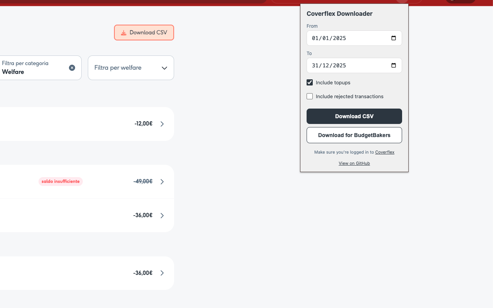

# Coverflex Transaction Downloader

Chrome extension to download Coverflex transactions as CSV files.




## Features

- **Two CSV formats**: Standard (complete data) or BudgetBakers-optimized
- **Flexible filtering**: Date range, topups, rejected transactions
- **Two ways to use**: Button on Coverflex page or extension popup
- **Privacy-first**: All processing happens locally, no external servers

### Known Limitations

- **Meal Vouchers ("Buoni Pasto") are NOT supported**: Currently, the extension only downloads the "WELFARE" transaction list.
    - *Reason:* I do not have access to the Meal Voucher feature on my account, so I cannot test or implement it.
    - *Contributing:* If you use Meal Vouchers and are interested in this feature, please open an issue or contact me to help implement support for it!

## Installation

### From Chrome Web Store

Visit the [Chrome Web Store page](https://chromewebstore.google.com/detail/coverflex-transaction-dow/liampbeldpbcnnokajmfeojfcnolgnfd
) and press Add to Chrome

### Manual Installation 

1. **Download the extension**
   - Go to the [Releases page](https://github.com/ilbonte/coverflex-downloader/releases/latest)
   - Download the `.zip` file (e.g., `coverflex-downloader-v1.0.0.zip`)

2. **Extract the archive**
   - Unzip the downloaded file to a folder on your computer
   - Remember the location of this folder

3. **Install in Chrome**
   - Open Chrome and navigate to `chrome://extensions/`
   - Enable **"Developer mode"** (toggle in the top-right corner)
   - Click **"Load unpacked"**
   - Select the folder where you extracted the extension
   - The extension should now appear in your extensions list


### For Development
```bash
git clone https://github.com/ilbonte/coverflex-downloader.git
cd coverflex-downloader
npm install
```

Load in Chrome:
1. Navigate to `chrome://extensions/`
2. Enable "Developer mode"
3. Click "Load unpacked" → Select the extension folder

## Usage

**On Coverflex website:**
1. Go to [Coverflex Activity](https://my.coverflex.com/benefits/activity)
2. Click the "Download CSV" button
3. Select filters and format

**From extension popup:**
Click the extension icon → Select options → Download

## CSV Formats

### Standard CSV
Complete transaction data with all fields (ID, date, merchant, amount, category, vouchers, rejection reasons, etc.)

### BudgetBakers CSV
Optimized for [Wallet by BudgetBakers](https://budgetbakers.com/):
- Date format: DD/MM/YYYY
- Delimiter: semicolon (`;`)
- Columns: Date, Amount, Payee, Note, Currency
- Always excludes rejected transactions

## Development

### Running Tests
```bash
npm install
npm test              # Run all tests
npm run test:watch    # Watch mode
npm run test:coverage # Coverage report
```


## Privacy

- **No external servers**: All data processing happens in your browser
- **No tracking**: We don't collect or send any data
- **Local storage only**: Authentication token stored locally (same as Coverflex)
- **Open source**: Review the code yourself

## Permissions

- `storage` - Store auth token locally
- `webRequest` - Capture auth token from Coverflex API requests
- Host permissions for `my.coverflex.com` and `menhir-api.coverflex.com` - Access Coverflex pages and API

## License

MIT
